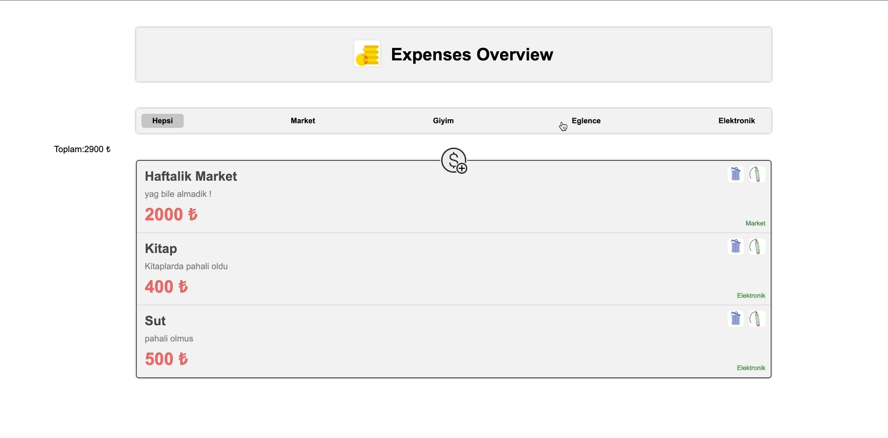

<h1>React Budget App</h1>

An simple React App where you can have a overview of your expenses

<h2>Used techniques</h2>

First started to create the Budget app with the life cycle methods and after processing the project further i decided to add the React Router Dom.

<h2> Screen gif of final result</h2>

